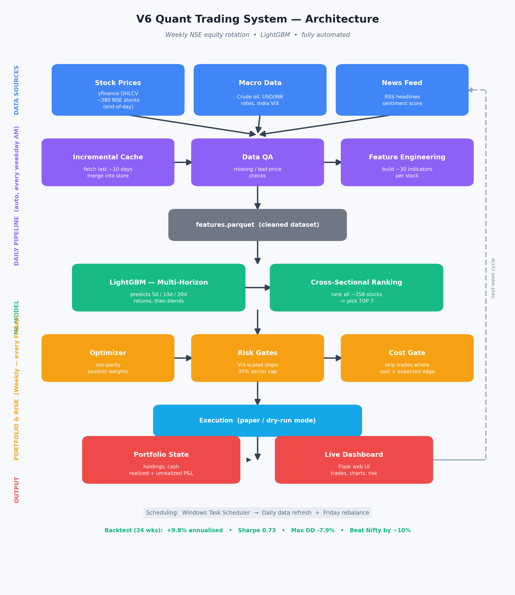

# AlphaRank — ML Stock-Ranking & Trading System (NSE)

A systematic **NSE weekly-rotation** equity strategy: a multi-horizon **LightGBM**
model ranks ~360 stocks cross-sectionally, holds the top 7, rebalances weekly, and is
fully risk-managed (VIX-adaptive stops, sector caps, transaction-cost gate). Paper /
dry-run mode.

**📊 [Live showcase →](https://hridye5h.github.io/alpharank-showcase/)** &nbsp;·&nbsp; **🖥️ [Live demo dashboard →](https://alpharank-dashboard.onrender.com)**

> This repository hosts the **public showcase** — architecture, components, and
> backtest results. The full implementation lives in a private repository.

## What it does

Every week the model scores ~360 NSE stocks, **ranks each against all the others**,
and holds the **top 7**. It blends 5-, 10-, and 20-day return forecasts, sizes
positions by risk-parity, and protects capital with VIX-adaptive stops, sector caps,
and a transaction-cost gate. It runs end-to-end on its own: daily data refresh,
weekly rebalance, and a live dashboard.

## Performance — 25-week walk-forward backtest (cost-adjusted)

| Metric | Value |
|---|---|
| **Excess return vs Nifty** | **+13.4%** |
| Annualised return | +4.7% |
| Sharpe ratio | 0.35 |
| Max drawdown | −5.6% |
| Nifty (same window) | −11.2% |

Transaction costs are deducted, so these are realistic figures — not a frictionless
curve. In a **−11% falling market** the strategy stayed positive: defensive,
market-beating behaviour. 25 weeks is still a small sample; live validation is ongoing.

## Under the hood

- **Multi-horizon model** — blends 5 / 10 / 20-day return forecasts (LightGBM)
- **~30 features** — momentum, volatility, RSI/MACD, volume, macro, sentiment, peer-ranks
- **Cross-sectional ranking** — picks relative winners, market-neutral by design
- **Risk-parity sizing** with 35% sector / 18% single-stock caps
- **VIX-adaptive stops** — tight in panic, loose when calm
- **Transaction-cost gate** — skips trades that can't beat their cost
- **Walk-forward backtest** with purge gaps + Nifty benchmark

---

Built with Python, LightGBM & Flask · paper / dry-run mode · for research and educational use.
